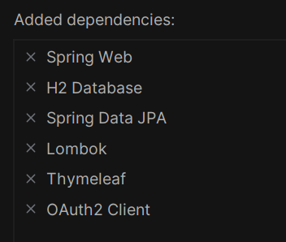

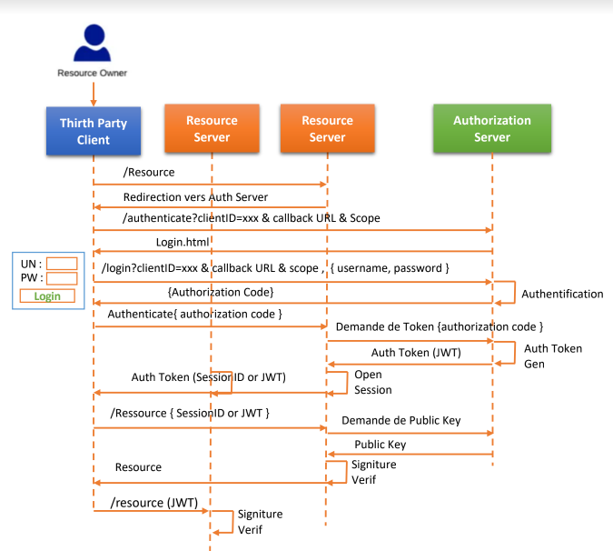

## Création du projet
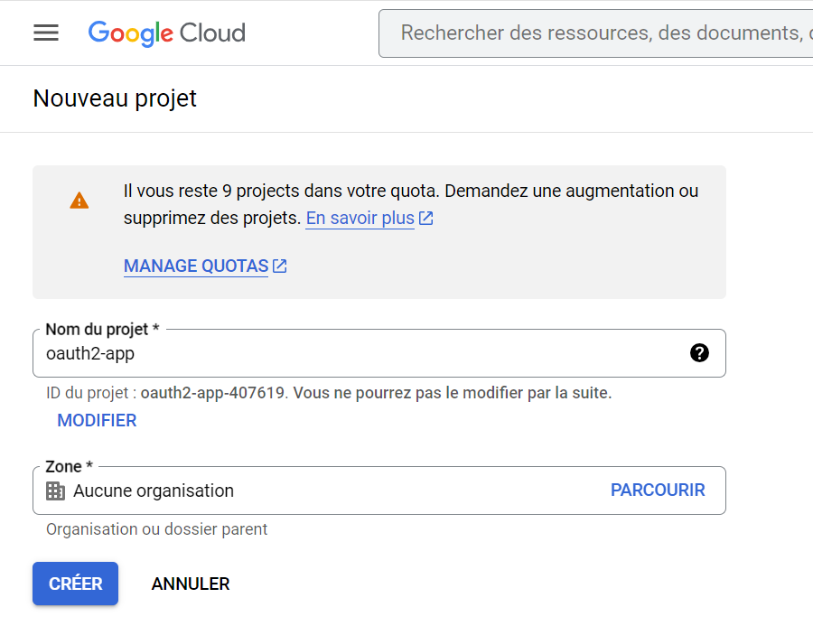

## Création d'API
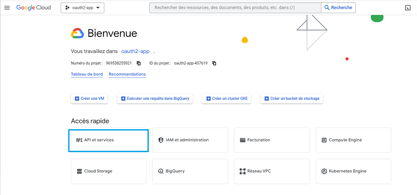

## Cliquer sur identifiants
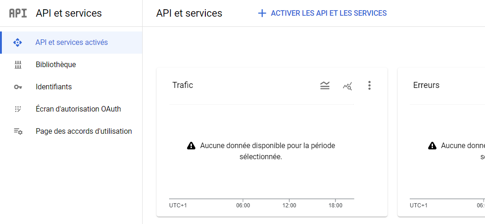

## Cliquer sur ID client OAuth
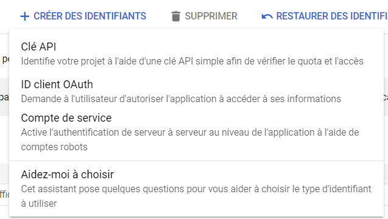

## Choisir externe pour autoriser tous les utilisateurs
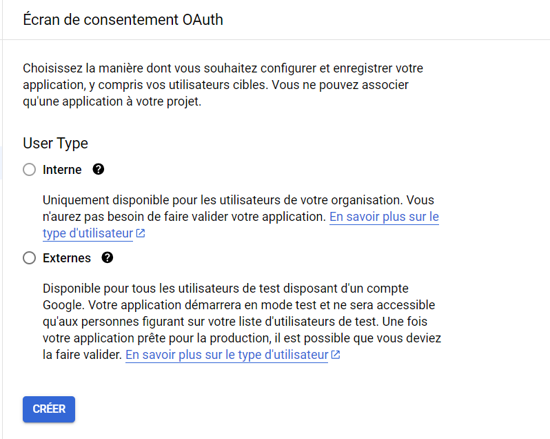

## Entrer le nom de l'application et l'adresse email
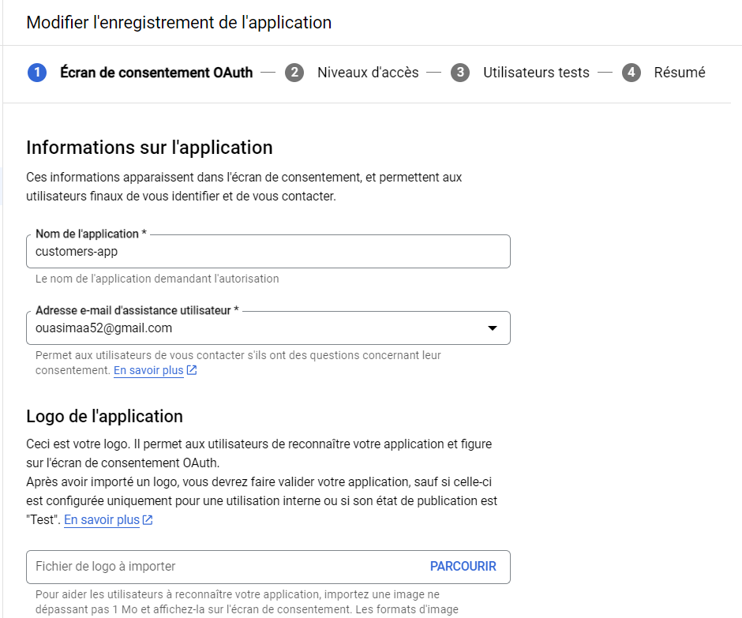

## Créer les identifiants, cliquer sur ID client OAuth
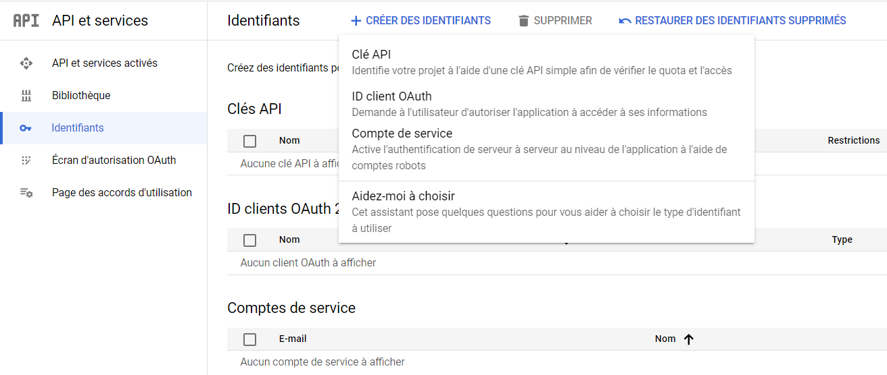

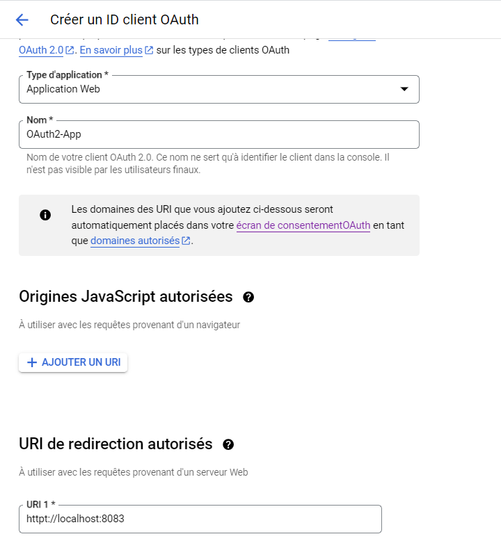

## Client OAuth créé
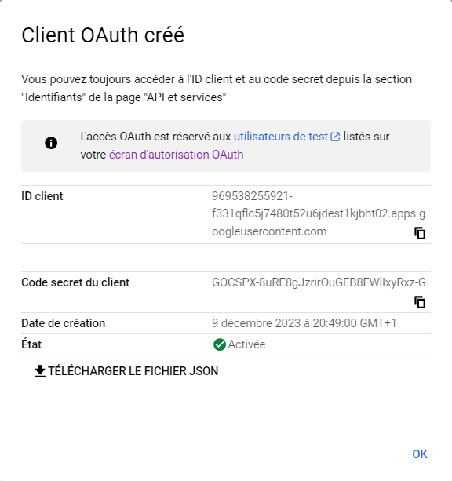


## Modifier l'url en mettant l'url de redirection de l'application
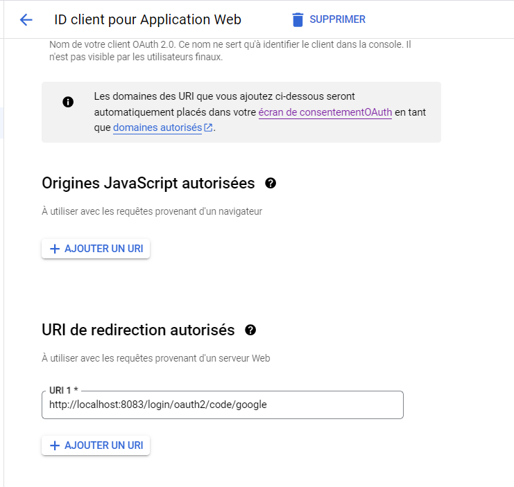

## ajouter les identifiants dans le fichier de configuration

```java
spring.security.oauth2.client.registration.google.clientId=294778775600-pi63tt3tep6tn58kanh7jeo9ovlk3j2r.apps.googleusercontent.com
spring.security.oauth2.client.registration.google.client-secret=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
spring.security.oauth2.client.provider.google.user-name-attribute=email
```
